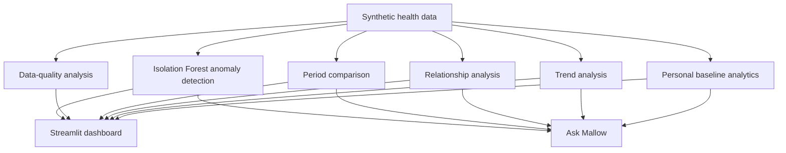

# Mallow 🌿

[](https://github.com/papoochu/mallow-health/actions/workflows/tests.yml)

Mallow is a personal health-data dashboard and intelligent health companion prototype built with Python and Streamlit.

The project explores how longitudinal wearable and wellness data can be turned into understandable personal insights without presenting statistical patterns as medical diagnoses. Mallow combines interactive visualization, personal-baseline analysis, trend detection, relationship analysis, anomaly detection, data-quality checks, and a natural-language interface for exploring health measurements.

> **Current prototype:** Mallow currently uses synthetic health data generated locally for development, testing, and demonstration. It is not connected to real patient records or wearable accounts.

## What Mallow can do

### 📈 Multi-timescale health dashboard

Mallow supports several views of the same health history:

- **Today** — synthetic intraday measurements throughout the day
- **7 days** — short-term patterns
- **30 days** — recent personal baseline and trend analysis
- **90 days** — longer-term context

Tracked prototype measurements include:

- Resting heart rate
- Heart-rate variability (HRV)
- Systolic and diastolic blood pressure
- Blood glucose
- Oxygen saturation
- Respiratory rate
- Wrist-temperature deviation
- Sleep duration, deep sleep, and REM sleep
- Pulse pressure and mean arterial pressure

### 🌱 Personal baseline analysis

Rather than labeling a measurement as universally "normal" or "abnormal," Mallow compares recent measurements with the person's own recent history.

The dashboard calculates personal averages, deviations, and z-scores and describes measurements using neutral language such as:

- Near your usual range
- Somewhat above your baseline
- Somewhat below your baseline
- Unusually above or below your baseline

These labels describe statistical difference from recent history, not clinical significance.

### 📊 Trend intelligence

Mallow fits simple linear trends across selected time windows and reports whether a measurement is:

- Trending upward
- Trending downward
- Showing no clear trend

Trend analysis also reports the estimated change across the window and how much usable data supports the estimate.

### ↔️ Period-to-period comparisons

For 7-day and 30-day views, Mallow compares the selected period with the equally sized period immediately before it.

Examples:

- Most recent 7 days vs. previous 7 days
- Most recent 30 days vs. previous 30 days

These comparisons use descriptive averages and deliberately avoid assuming that higher or lower automatically means healthier.

### 🔗 Relationship discovery

Mallow explores statistical relationships between health measurements using Pearson correlation.

The Relationships view can:

- Automatically surface the strongest recent relationships
- Compare any two supported measurements
- Plot paired observations and a fitted trend line
- Report correlation strength and direction
- Show the number of paired observations used
- Report data support for the analysis

Relationship descriptions explicitly distinguish **association from causation**.

### 🤖 Statistical anomaly detection

Mallow uses an **Isolation Forest** model from scikit-learn to evaluate whether the latest combination of measurements is statistically unusual relative to recent history.

The current day is excluded from model training before it is evaluated.

To make the result easier to understand, Mallow supplements the Isolation Forest result with personal-baseline deviations that identify which measurements differ most from recent history.

This feature detects unusual statistical patterns only. It does not diagnose disease or determine whether a measurement is medically concerning.

### 💬 Ask Mallow

Ask Mallow is a deterministic natural-language interface for querying the dashboard's analytics.

Example questions include:

- "How is my HRV trending?"
- "Is my resting heart rate going down?"
- "What is related to my sleep?"
- "Does sleep seem related to resting heart rate?"
- "What was my average glucose over the last 7 days?"
- "How does my HRV compare with last week?"
- "Anything unusual today?"
- "What are my clearest trends?"

Questions can inherit the dashboard's selected time window or explicitly request another period.

The current assistant intentionally routes questions through Mallow's existing analytics functions instead of generating unsupported medical interpretations.

### 🔎 Data quality and support

Mallow tracks how much usable data supports an analysis.

The prototype reports:

- Available sample count
- Measurement coverage
- Paired observations for correlations
- **Limited / Moderate / Good / High** data-support labels

"Data support" refers only to data availability. It is not a confidence interval, clinical confidence score, or measure of diagnostic certainty.

## Architecture



The analytics layer is separated into small modules so calculations used by the UI and Ask Mallow can share the same implementation.

## Project structure

```text
mallow-health/
├── .github/
│   └── workflows/
│       └── tests.yml
├── app.py
├── run_tests.py
├── requirements.txt
├── src/
│   ├── __init__.py
│   ├── analytics.py
│   ├── anomaly.py
│   ├── assistant.py
│   ├── comparisons.py
│   ├── data.py
│   ├── data_quality.py
│   ├── insights.py
│   ├── relationships.py
│   └── trends.py
└── tests/
    ├── __init__.py
    └── test_core.py
```

## Tech stack

- **Python**
- **Streamlit** — interactive application UI
- **Pandas** — data manipulation
- **NumPy** — numerical analysis and synthetic-data generation
- **Plotly** — interactive visualization
- **scikit-learn** — Isolation Forest anomaly detection
- **unittest** — automated analytics tests
- **GitHub Actions** — continuous integration

## Running Mallow locally

### 1. Clone the repository

```bash
git clone https://github.com/papoochu/mallow-health.git
cd mallow-health
```

### 2. Create a virtual environment

Windows PowerShell:

```powershell
python -m venv .venv
.\.venv\Scripts\Activate.ps1
```

macOS / Linux:

```bash
python3 -m venv .venv
source .venv/bin/activate
```

### 3. Install dependencies

```bash
python -m pip install -r requirements.txt
```

### 4. Start the app

```bash
streamlit run app.py
```

## Running the tests

Run the complete automated test suite from the project root:

```bash
python run_tests.py
```

The test suite currently covers core behavior including:

- Positive and negative relationship detection
- Constant-data and insufficient-data edge cases
- Association-vs-causation wording
- Increasing, decreasing, and unclear trends
- Adjacent-period comparisons
- Missing-value coverage
- Data-support classification
- Natural-language time-window parsing
- HRV vs. heart-rate routing
- Ask Mallow trend and relationship behavior

GitHub Actions automatically runs the same test suite on pushes and pull requests targeting `main`.

## Design principles

Mallow is being built around a few core principles:

1. **Personal context before population labels**  
   Recent personal history is often more informative for a monitoring interface than presenting every value as a universal threshold judgment.

2. **Explain the analysis**  
   Users should be able to see what data supports an observation and how a conclusion was produced.

3. **Association is not causation**  
   Correlation results are described as relationships in the available data, not evidence that one measurement caused another.

4. **Uncertainty should be visible**  
   Short windows, missing measurements, and limited sample sizes should reduce the strength of the language used by the interface.

5. **Analytics are not diagnosis**  
   Statistical unusualness and personal-baseline changes do not automatically indicate illness.

## Current limitations

Mallow is an early portfolio prototype.

Current limitations include:

- All displayed measurements are synthetic
- No Apple Health, wearable, EHR, or CGM integration yet
- No authentication or multi-user storage
- No clinician-facing workflow
- No prospective clinical validation
- Correlation analysis does not control for confounders
- Linear trends may not represent nonlinear physiological behavior
- Isolation Forest output detects statistical unusualness, not medical risk
- Ask Mallow currently uses deterministic intent routing rather than a general-purpose language model

## Roadmap

Potential future development includes:

- Importing user-authorized Apple Health or wearable data
- More robust missing-data handling
- Contextual annotations for exercise, illness, medication, and other events
- Additional longitudinal and change-point analysis
- Model evaluation on realistic simulated datasets
- Improved explainability for anomaly detection
- More flexible natural-language querying
- Secure user profiles and longitudinal storage
- Deployment of an interactive public demo using synthetic data

## Safety note

Mallow is a software and data-science portfolio project.

It is **not intended for diagnosis, treatment, emergency decision-making, or clinical use**. Personal-baseline labels, correlations, trends, and anomaly scores describe statistical patterns in the available data and should not be interpreted as medical conclusions.
