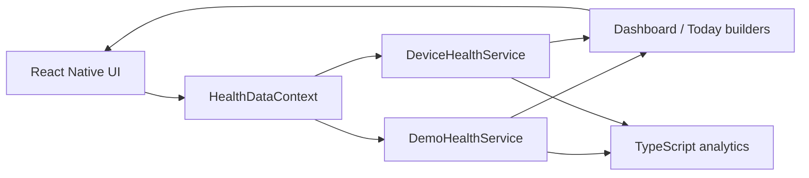
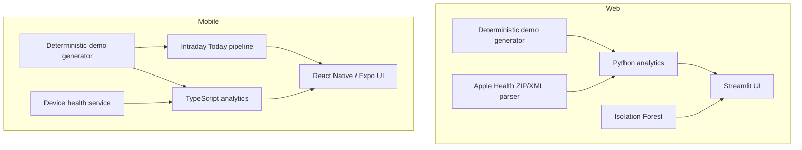

# Mallow

[](https://github.com/papoochu/mallow-health/actions/workflows/tests.yml)
[](https://mallow-health.streamlit.app/)

**Live web demo:** https://mallow-health.streamlit.app/

Mallow is a personal health-data dashboard and intelligent health companion built to explore longitudinal wearable and wellness data without presenting statistical patterns as medical diagnoses.

The project now has two front ends:

- a deployed **Python + Streamlit web application**
- a **React Native + Expo + TypeScript mobile application**

Both are built around the same core product idea: compare measurements with the person's own recent history, surface understandable statistical patterns, make uncertainty visible, and avoid turning descriptive analytics into medical claims.

> **Public demo safety:** the deployed Streamlit app uses synthetic data only. Real Apple Health exports are processed locally when the web app is run by the user.

---

## Why I built it

Health dashboards often show isolated measurements or generic reference ranges without much explanation of how an individual's recent pattern is changing.

Mallow explores a different interaction model:

- What is usual **for this person**?
- Has a measurement been changing recently?
- How much usable data supports that observation?
- Are two measurements moving together?
- Is today's multivariate pattern statistically unusual?
- Can those questions be asked in ordinary language without inventing medical conclusions?

This is a software-engineering and data-science portfolio project, not a clinical product.

---

## Current project status

| Capability | Status |
| --- | --- |
| Streamlit web dashboard | ✅ Implemented and deployed |
| Synthetic daily data | ✅ Implemented |
| Synthetic intraday / Today data | ✅ Implemented |
| Personal-baseline analytics | ✅ Implemented |
| Trend analysis | ✅ Implemented |
| Period comparisons | ✅ Implemented |
| Relationship / correlation analysis | ✅ Implemented |
| Isolation Forest anomaly detection | ✅ Implemented on web |
| Ask Mallow deterministic query interface | ✅ Implemented |
| Apple Health ZIP/XML import on web | ✅ Implemented |
| Real-data missing-value handling | ✅ Implemented |
| React Native / Expo mobile app | ✅ Implemented |
| Mobile Today / intraday experience | ✅ Implemented |
| Native device-health service boundary | ✅ Implemented |
| HealthKit / Health Connect integration layer | 🟡 Integration-ready |
| Physical iPhone HealthKit validation | ⏳ Planned final validation step |
| Python automated tests | ✅ 34 tests |
| Mobile TypeScript automated tests | ✅ 23 tests |
| GitHub Actions CI | ✅ Python + mobile jobs |

The native device-health layer is intentionally described as **integration-ready**, not physically validated. Final iPhone validation requires Apple Developer signing and is planned for the end of the project.

---

## What Mallow can do

### Multi-timescale health dashboard

Mallow works across several views of the same health history:

- **Today** — intraday measurements throughout the day
- **7 days** — short-term patterns
- **30 days** — recent personal baseline and trend analysis
- **90 days** — longer-term context

Tracked prototype measurements include:

- Resting heart rate
- Heart rate
- Heart-rate variability (HRV)
- Systolic and diastolic blood pressure
- Blood glucose
- Oxygen saturation
- Respiratory rate
- Wrist-temperature deviation
- Sleep duration
- Deep sleep
- REM sleep
- Pulse pressure
- Mean arterial pressure

The mobile Today screen keeps intraday measurements separate from longer-term daily summaries. For example, an afternoon heart-rate sample is not treated as interchangeable with a daily resting-heart-rate measurement.

---

### Personal baseline analysis

Instead of labeling measurements as universally "normal" or "abnormal," Mallow compares recent values with the person's own recent history.

The baseline layer calculates:

- recent personal averages
- sample standard deviation
- z-scores
- latest non-missing values

It then describes statistical difference using neutral language such as:

- Near your usual range
- Somewhat above your baseline
- Somewhat below your baseline
- Unusually above your baseline
- Unusually below your baseline

These labels describe distance from recent personal history, not clinical significance.

---

### Trend intelligence

Mallow fits a simple least-squares trend across the selected period.

Trend interpretation considers both:

- magnitude of change relative to recent spread
- goodness of fit

The result is described as:

- No clear trend
- Gradually increasing / decreasing
- Clearly increasing / decreasing

Trend wording explicitly states that recent change is descriptive and **not a prediction**.

---

### Period-to-period comparisons

Mallow compares a selected period with the equally sized period immediately before it.

Examples:

- latest 7 days vs. previous 7 days
- latest 30 days vs. previous 30 days

The comparison reports recent averages, absolute change, percentage change, and whether the value was higher, lower, or about the same.

It deliberately does not assume that higher or lower automatically means medically better or worse.

---

### Relationship discovery

Mallow explores pairwise relationships using Pearson correlation.

The relationship layer can:

- align pairwise non-missing observations
- calculate Pearson correlation
- describe relationship strength and direction
- rank the strongest recent relationships
- report the number of paired observations used
- preserve association-vs-causation language

Example output:

> Higher sleep duration has tended to occur alongside higher HRV in the recent data. This is an association and does not show that one measurement caused the other.

---

### Statistical anomaly detection

The web application uses an **Isolation Forest** model from scikit-learn to determine whether the latest multivariate measurement pattern is statistically unusual relative to recent history.

The current point is excluded from model training before it is evaluated.

Mallow supplements the model result with personal-baseline deviations so the user can see which measurements differ most from recent history.

This detects statistical unusualness only. It does not diagnose disease or estimate medical risk.

---

### Ask Mallow

Ask Mallow is a deterministic natural-language interface that routes user questions into the same analytics functions used by the dashboard.

Supported question types include:

- "How has my HRV changed this month?"
- "What is related to my sleep?"
- "Does sleep seem related to resting heart rate?"
- "What was my average glucose over the last 7 days?"
- "How does this week compare with last week for resting heart rate?"
- "What are my clearest trends?"

The assistant does not generate unsupported medical interpretations. It selects the relevant metric, time window, and analysis, then returns calculated results with the same safety language used elsewhere in the application.

---

### Data support and missingness

Mallow treats missing measurements as missing.

It does not:

- manufacture values
- replace missing real data with synthetic fallback
- treat unavailable permissions as healthy values
- convert sparse data into false certainty

The application reports sample availability using **Limited / Moderate / Good / High** data-support labels.

Data support refers to measurement availability only. It is not a confidence interval, clinical confidence score, or diagnostic certainty estimate.

---

## Real-data support

### Apple Health export import — web

The Streamlit app can import a user-provided Apple Health export ZIP or XML file.

Supported Apple Health measurements include:

- resting heart rate
- HRV
- blood pressure
- blood glucose
- oxygen saturation
- respiratory rate
- sleeping wrist temperature
- sleep analysis

The parser:

- streams large XML exports with `ElementTree.iterparse`
- converts supported units
- merges overlapping sleep intervals
- separates deep and REM sleep
- derives pulse pressure and mean arterial pressure
- keeps unavailable measurements as missing
- processes imported data locally

The public web deployment remains synthetic-only so private health exports are not uploaded to the portfolio demo.

---

### Native device-health architecture — mobile

The mobile app has a service boundary that separates data acquisition from analysis:



The current device service is designed for read-only access through the native health integration layer.

Physical iPhone HealthKit validation is deliberately deferred until the final project stage, when Apple Developer signing is available.

---

## Cross-platform architecture



The important architectural decision is that **data ingestion is replaceable while analytics remain reusable**.

Synthetic demo data, imported Apple Health data, and future native HealthKit / Health Connect data all feed structured health records rather than embedding source-specific logic throughout the UI.

---

## Repository structure

```text
mallow-health/
├── .github/
│   └── workflows/
│       └── tests.yml
│
├── app.py
├── requirements.txt
├── run_tests.py
│
├── src/
│   ├── analytics.py
│   ├── anomaly.py
│   ├── apple_health.py
│   ├── assistant.py
│   ├── comparisons.py
│   ├── data.py
│   ├── data_quality.py
│   ├── insights.py
│   ├── relationships.py
│   └── trends.py
│
├── tests/
│   ├── test_core.py
│   ├── test_apple_health.py
│   └── test_real_data_safety.py
│
├── mobile/
│   ├── App.tsx
│   ├── app.config.ts
│   ├── eas.json
│   ├── package.json
│   ├── vitest.config.ts
│   ├── tests/
│   └── src/
│       ├── analytics/
│       ├── components/
│       ├── data/
│       ├── models/
│       ├── screens/
│       ├── services/
│       └── theme/
│
└── docs/
    ├── ARCHITECTURE.md
    └── PORTFOLIO_CASE_STUDY.md
```

---

## Tech stack

### Web

- **Python**
- **Streamlit**
- **Pandas**
- **NumPy**
- **Plotly**
- **scikit-learn**
- **ElementTree**
- **unittest**

### Mobile

- **TypeScript**
- **React Native**
- **Expo**
- **Vitest**
- native device-health service architecture for HealthKit / Health Connect

### Engineering

- **GitHub Actions**
- deterministic synthetic-data generation
- modular analytics services
- CI for both Python and TypeScript implementations

---

## Testing

Mallow currently has:

- **34 Python tests**
- **23 mobile TypeScript tests**
- **57 automated tests total**

GitHub Actions runs two independent jobs on pushes and pull requests targeting `main`:

```text
Mallow Tests
├── Python health analytics
└── Mobile TypeScript analytics
```

The test suites cover:

- baseline calculations
- sample standard deviation
- latest non-missing values
- positive and negative correlations
- association-vs-causation wording
- insufficient-data behavior
- increasing, decreasing, and unclear trends
- adjacent-period comparisons
- data-support classification
- natural-language metric routing
- time-window parsing
- deterministic synthetic data
- derived blood-pressure values
- bounded intraday generation
- Today summary calculations
- missing-value preservation
- Apple Health parsing and unit conversion
- real-data safety behavior

---

## Running the web application

### 1. Clone

```bash
git clone https://github.com/papoochu/mallow-health.git
cd mallow-health
```

### 2. Create a virtual environment

Windows PowerShell:

```powershell
python -m venv .venv
.\.venv\Scripts\Activate.ps1
```

macOS / Linux:

```bash
python3 -m venv .venv
source .venv/bin/activate
```

### 3. Install dependencies

```bash
python -m pip install -r requirements.txt
```

### 4. Run

```bash
streamlit run app.py
```

---

## Running the mobile application

```bash
cd mobile
npm install
npm start
```

For the browser preview, press:

```text
w
```

The browser build uses synthetic demo data.

A native HealthKit development build requires iOS signing and is intentionally saved for the project's final validation stage.

---

## Running the tests

From the repository root:

```bash
python run_tests.py
```

For the mobile suite:

```bash
cd mobile
npm test
```

---

## Design principles

1. **Personal context before universal judgment**  
   Recent personal history is used as context rather than turning every value into a generic threshold label.

2. **Explain the analysis**  
   The interface exposes what data supports an observation and which calculation produced it.

3. **Association is not causation**  
   Correlations are described as relationships in the observed data, not evidence that one variable caused another.

4. **Missing means missing**  
   Real-data mode never silently substitutes synthetic measurements.

5. **Uncertainty should be visible**  
   Sparse windows and incomplete measurements reduce the strength of the language used by the interface.

6. **Daily and intraday measurements are not interchangeable**  
   Measurements collected for different physiological contexts stay in separate analytical pathways.

7. **Analytics are not diagnosis**  
   Statistical unusualness, baseline changes, trends, and correlations are not medical conclusions.

8. **Privacy by architecture**  
   The public demo uses synthetic data; imported personal health data can remain local.

---

## Current limitations

- Native HealthKit behavior has not yet been physically validated on an iPhone.
- The mobile native health integration is read-oriented and still requires final signed-device testing.
- No authentication or cloud user-profile system is included.
- No clinician-facing workflow is included.
- No prospective clinical validation has been performed.
- Correlation analysis does not control for confounders.
- Linear trends may not capture nonlinear physiological behavior.
- Isolation Forest detects statistical unusualness, not medical risk.
- Ask Mallow uses deterministic intent routing rather than a general-purpose language model.
- The project does not provide emergency monitoring.

---

## Final validation plan

The last planned project stage is native iOS validation:

1. enroll in the Apple Developer Program
2. create a signed Expo development build
3. install Mallow on a physical iPhone
4. verify HealthKit permission prompts
5. test supported real Apple Health measurements
6. verify denied / missing permissions remain missing
7. validate Today behavior with real samples
8. capture final mobile screenshots and demo video
9. update documentation from "integration-ready" to "validated on physical iOS device"

---

## Portfolio notes

For a shorter explanation of the product decisions, tradeoffs, and engineering story, see:

- [`docs/PORTFOLIO_CASE_STUDY.md`](docs/PORTFOLIO_CASE_STUDY.md)
- [`docs/ARCHITECTURE.md`](docs/ARCHITECTURE.md)

---

## Safety note

Mallow is a software-engineering and data-science portfolio project.

It is **not intended for diagnosis, treatment, emergency decision-making, or clinical use**. Personal-baseline labels, correlations, trends, anomaly scores, and data-support labels describe statistical patterns in the available data and should not be interpreted as medical conclusions.
