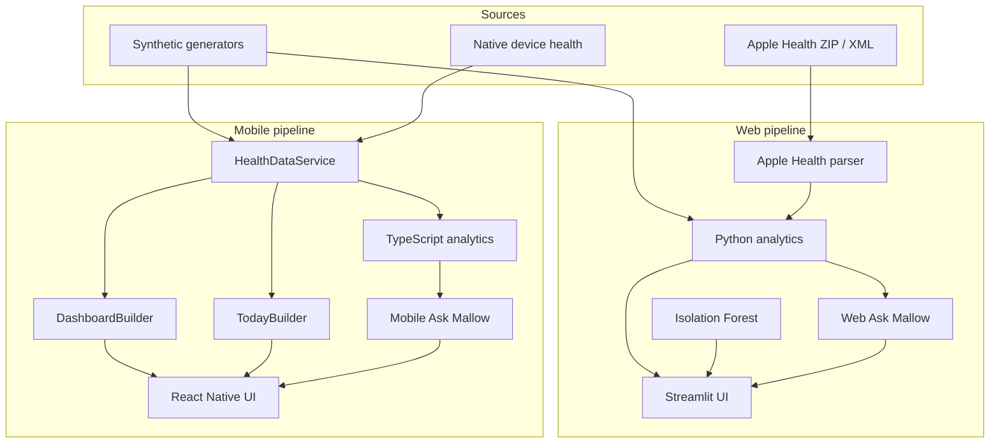

# Mallow Architecture 🌿

## Goals

Mallow's architecture is built around four constraints:

1. analytics should not depend on one particular data source
2. synthetic demo mode and real-data mode must never be silently mixed
3. mobile intraday data should remain separate from daily baseline analytics
4. the UI should consume structured analytical results rather than reimplement statistics

---

## System overview



---

## Web architecture

### `src/data.py`

Generates deterministic synthetic daily and intraday measurements.

The synthetic relationships are intentionally structured so the application has meaningful patterns to analyze.

### `src/apple_health.py`

Parses manual Apple Health export ZIP/XML files.

Responsibilities include:

- streaming XML records
- supported identifier mapping
- unit conversion
- sleep interval merging
- deep / REM extraction
- wrist-temperature transformation
- derived blood-pressure values
- preservation of missing values

### Analytics modules

The Python analytics are split across small modules:

- `analytics.py` — baseline summaries and z-scores
- `trends.py` — least-squares trend classification
- `relationships.py` — Pearson correlation analysis
- `comparisons.py` — adjacent-period comparisons
- `data_quality.py` — sample-support classification
- `anomaly.py` — Isolation Forest anomaly detection
- `assistant.py` — deterministic question routing
- `insights.py` — dashboard-oriented interpretation

### `app.py`

The Streamlit layer handles:

- view state
- theme
- charts
- cards
- real-vs-demo mode
- import controls
- Ask Mallow UI

The statistical logic remains outside the UI.

---

## Mobile architecture

The mobile app uses React Native + Expo + TypeScript.

### `HealthDataService`

The service interface provides a stable boundary between data acquisition and the application.

Conceptually:

```ts
interface HealthDataService {
  getDashboard(windowDays): Promise<DashboardData>;
  ask(question, windowDays): Promise<string>;
  getToday?(): Promise<TodayData>;
}
```

Current implementations:

- `DemoHealthService`
- `DeviceHealthService`

The rest of the app does not need to know which source produced the records.

### `HealthDataContext`

The React context owns:

- active data source
- selected time window
- loading / error state
- dashboard data
- Today data
- Ask Mallow requests
- switching between demo and device modes

### Builders

`DashboardBuilder` converts daily records into presentation-ready dashboard structures.

`TodayBuilder` converts intraday records into:

- latest values
- daily averages
- ranges
- sample counts
- chart points

This keeps presentation formatting separate from raw sample retrieval.

### Analytics

The TypeScript analytics port the same core concepts used on the web:

- baseline calculations
- sample standard deviation
- trend regression
- relationship analysis
- period comparisons
- data-support classification
- deterministic question parsing

---

## Daily vs. intraday records

Mallow intentionally uses different data models.

### Daily

```text
DailyHealthRecord
├── date
├── resting_hr
├── hrv
├── blood pressure
├── glucose
├── oxygen saturation
├── respiratory rate
├── wrist temperature deviation
└── sleep metrics
```

Used for:

- personal baselines
- 7 / 30 / 90 day trends
- relationships
- comparisons

### Intraday

```text
IntradayHealthRecord
├── timestamp
├── heart_rate
├── hrv
├── glucose
├── oxygen saturation
├── respiratory rate
├── wrist temperature
└── sparse blood pressure
```

Used for:

- Today timeline
- latest value
- today's average
- within-day range

The separation prevents inappropriate comparisons between contextually different measurements.

---

## Data-source safety

### Demo mode

Demo mode uses deterministic synthetic data.

It is safe for:

- public deployment
- screenshots
- tests
- portfolio demonstrations

### Real-data mode

Real-data paths follow two rules:

1. missing data stays missing
2. no synthetic fallback is inserted into real data

That behavior is explicitly tested.

---

## Native health status

The mobile device-health path is designed to sit behind the same service interface as demo data.

The current implementation is **integration-ready** but has not yet been physically validated on a signed iOS build.

This is a tooling/signing limitation, not a reason to weaken the architecture by embedding platform-specific logic throughout the UI.

Final validation will test:

- authorization
- supported sample reads
- unit handling
- missing / denied access
- real Today behavior

---

## Test architecture

GitHub Actions runs two jobs.

### Python

Covers:

- analytics
- Apple Health parsing
- missing-data safety
- Ask Mallow
- anomaly / relationship / comparison behavior

### TypeScript

Covers:

- statistics
- baselines
- trends
- relationships
- comparisons
- deterministic demo generation
- intraday generation
- Today summaries
- Ask Mallow

The goal is to test analytical behavior and data contracts rather than only rendering snapshots.

---

## Key architectural tradeoffs

### Deterministic assistant instead of an LLM

This limits conversational flexibility but makes every health answer traceable to known calculations.

### Manual Apple Health export on web

A browser cannot directly access iOS HealthKit. Manual export provides a privacy-conscious real-data path without pretending the web application has native device privileges.

### Native service boundary on mobile

HealthKit / Health Connect integration is isolated from analytics and UI so native APIs can evolve without forcing a rewrite of the application.

### Separate Python and TypeScript analytics

This introduces duplication, but it also allows each application to calculate locally and independently. The automated tests help keep behavior aligned.
